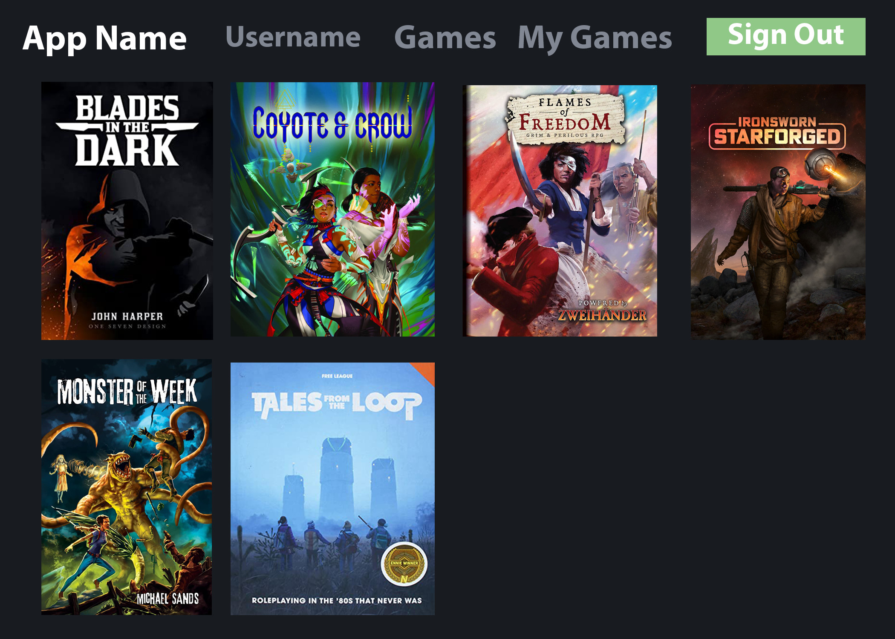
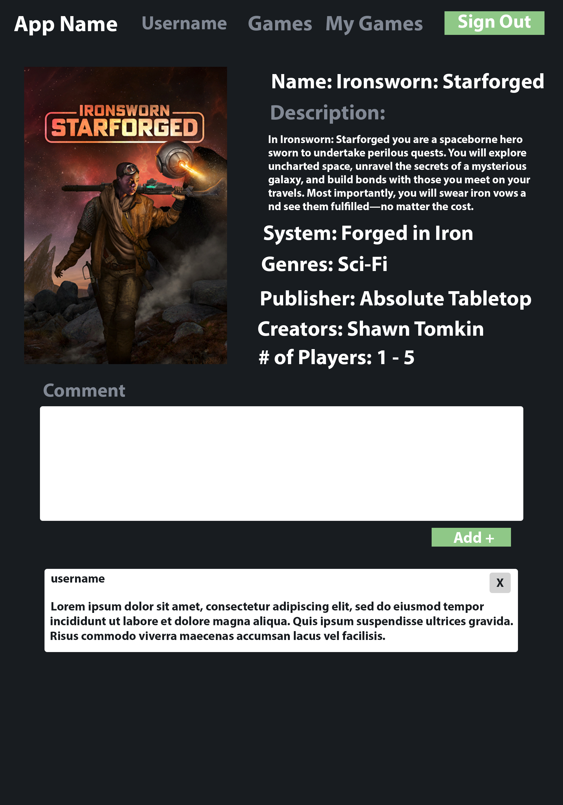

# PROJECT 2 #

## TABLETOP RPG BOOK COLLECTION TRACKER ##

**Example Image 1**

**Example Image 2**

**Entity-Relationship Diagram** 

### REQUIREMENTS

- Models: User, Collection, Comments
- API: Board Game Atlas: https://www.boardgameatlas.com/api/docs
- RESTful routes: utilize routes for examples of user story below such as showing all the books, showing the users collection, adding and deleting books to their collection etc. 
- ODM / MongoDB - utilize ODM to create a database of game information

### USER STORY 

- As a user they want to be able to be able to add items they own to a collection
- They want be able to see what books they have in their collection 
- They want to be able to add new books to their collection 
- They want to be able to delete books from their collection
- They want to be able to sort the books by name, genre, system, creator, type etc. 

- Stretch Goal - Being able to access their owned PDFs versions from the app either from a local directory where it is stored or from their Google Drive

### IMPLEMENTATION 

- A database where information about the games are stored
- A page that shows a list of available games to add
- A page that shows information about the individual game 
- A page for users to add a game if they game does not exist 
- A page to edit the information about their copy of the game 
- A page that shows the user's library of games
- A sidebar or top menu bar to show the various options 
- A way to sort games

### TECHNOLOGIES 

- HTML, CSS, CSS Bootstrap, JavaScript, Liquid JS, Express, MongoDB, Board Game Atlas API